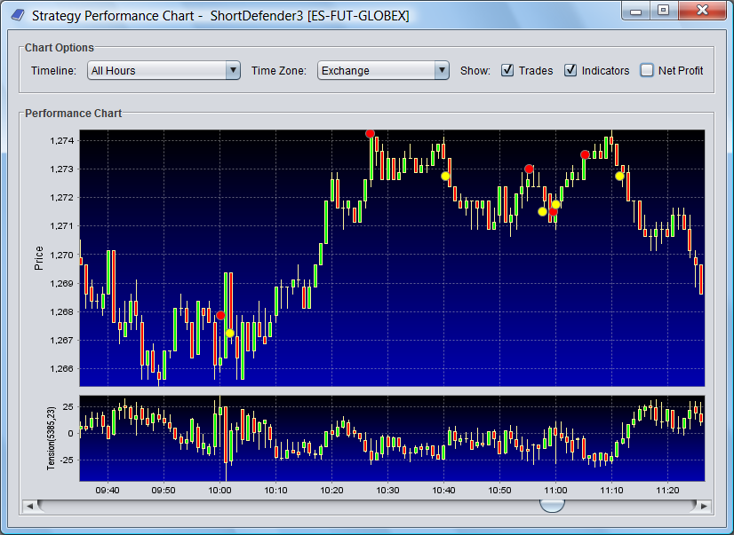
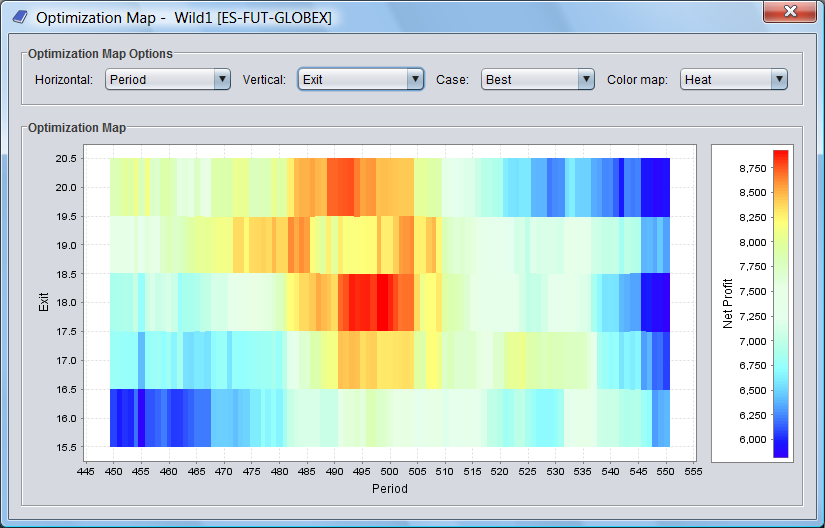

# JBookTrader 

JBookTrader is a fully automated trading system (ATS) that can trade various
types of market securities during the trading day without user monitoring. All
aspects of trading, such as obtaining market prices, analyzing price patterns,
making trading decisions, placing orders, monitoring order executions, and 
controlling the risk are automated according to the user preferences. The 
central idea behind JBookTrader is to completely remove emotions from trading, 
so that the trading system can systematically and consistently follow a 
predefined set of rules.

The features include strategy back testing, optimization, market data recording,
and real time trading via the Interactive Brokers API.

JBookTrader is written in Java and is intended for software developers. It is
not an "off-the-shelf" product that can be installed and run. Instead,
JBookTrader provides a framework for developing automated trading systems and
requires a certain amount of programming knowledge and experience in Java. If
you are not a software developer or if you don't have much experience
programming in Java, JBookTrader is probably not for you.

Before you start working with JBookTrader, please read the JBookTrader User
Guide and the documents located in the /docs directory of the distribution.

